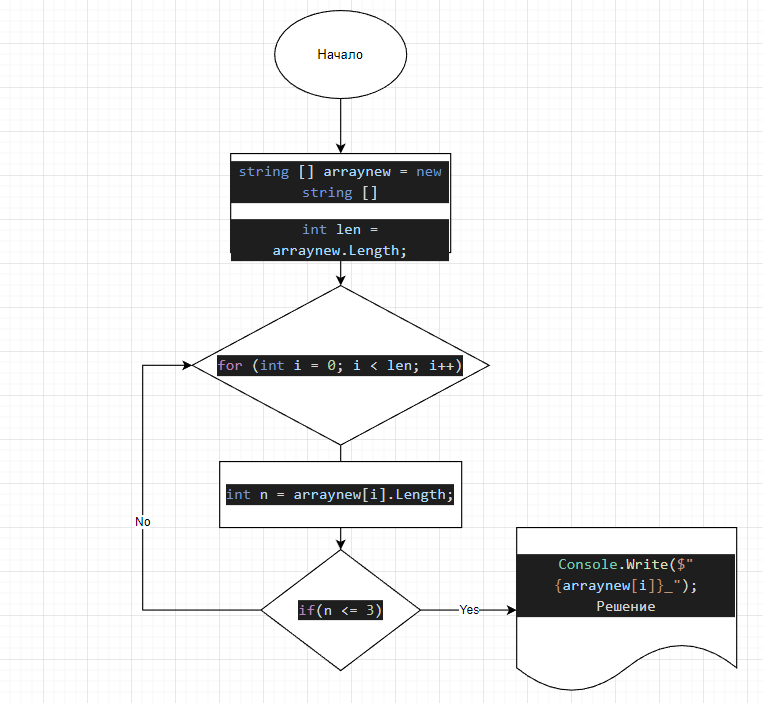

## Описание проекта.

 * Создать репозиторий на GitHub.
 * Нарисовать блок - схему алгаритма.
 * Снабдить репозиторий оформленным текстом описанием решения(файл README.md).
 * Написать программу, решающаю поставленную задачу.
 * Использовать контроль версий в работе над этим небольшим проектом ( у каждого этапа свои коммиты ).
  ***
## Задача.
### Написать программу, которая из имеющегося массива строк формирует массив из строк, длина которых меньше либо равна 3 символа. Первоначальный массив можно ввести с клавиатуры, либо задать на старте выполнения алгоритма. При решении не рекомендуется пользоваться коллекциями, лучше обойтись исключительно массивами.
***
